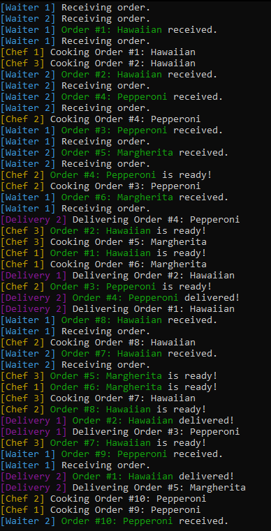
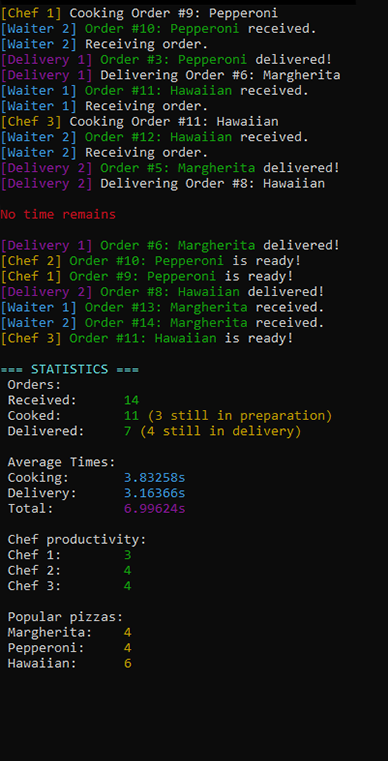

# 🍕 Pizza Restaurant Simulator

Багатопотокова симуляція піцерії на C++ з використанням `std::thread`, `std::mutex` та `std::condition_variable`.

## 📋 Опис

Програма симулює роботу піцерії з кількома ролями, які працюють паралельно:
- **Офіціанти (Waiters)** — приймають замовлення від клієнтів
- **Кухарі (Chefs)** — готують піцу
- **Кур'єри (Delivery)** — доставляють готову піцу

Всі процеси синхронізовані через черги та condition variables.

## 🎯 Особливості

- ✅ 7+ паралельних потоків (2 офіціанти, 3 кухарі, 2 кур'єри)
- ✅ Синхронізація через `std::condition_variable`
- ✅ Потокобезпечні черги з `std::mutex`
- ✅ Атомарний лічильник замовлень (`std::atomic`)
- ✅ Вимірювання часу через `std::chrono`
- ✅ Детальна статистика після зупинки
- ✅ Кольоровий вивід в терміналі (ANSI codes)

## 🛠️ Технології

- **C++11/14** (thread, mutex, condition_variable, atomic, chrono)
- **ANSI Escape Codes** для кольорового виводу
- **Producer-Consumer Pattern** для черг

## 📊 Статистика

Після завершення роботи програма виводить:
- Кількість прийнятих/приготованих/доставлених замовлень
- Середній час готування та доставки
- Продуктивність кожного кухаря
- Популярність типів піци

## 🚀 Як запустити

### Компіляція (GCC/Clang):
```bash
g++ -std=c++11 -pthread manager.cpp Waiter.cpp Chef.cpp Delivery.cpp OrderQueue.cpp Statistics.cpp -o pizza_restaurant
./pizza_restaurant
```

### Компіляція (Visual Studio):
Відкрити проєкт у Visual Studio і натиснути `F5` (Run).

## 📸 Скріншоти




## 📂 Структура проєкту
```
pizza-restaurant/
├── main.cpp              # Головний файл
├── Order.h               # Структура замовлення
├── OrderQueue.h/cpp      # Потокобезпечна черга
├── Waiter.h/cpp          # Офіціанти
├── Chef.h/cpp            # Кухарі
├── Delivery.h/cpp        # Кур'єри
├── Statistics.h/cpp      # Збір статистики
├── Colors.h              # ANSI коди для кольорів
├── README.md             # Ця документація
└── screenshots/
    └── demo.png          # Скріншот роботи
```

## 🎓 Чому я навчився під час створення/Чим ця програма може бути корисною?

- Робота з `std::thread` та життєвим циклом потоків
- Синхронізація через `std::mutex` та `std::condition_variable`
- Уникнення race conditions та deadlocks
- Патерн Producer-Consumer
- Використання `std::atomic` для потокобезпечних операцій
- Вимірювання часу з `std::chrono`

## 📝 Ліцензія

MIT License — можна використовувати та модифікувати вільно.

## 👤 Автор

[Олександр Копій] — [https://github.com/SamuraiSanch]
```